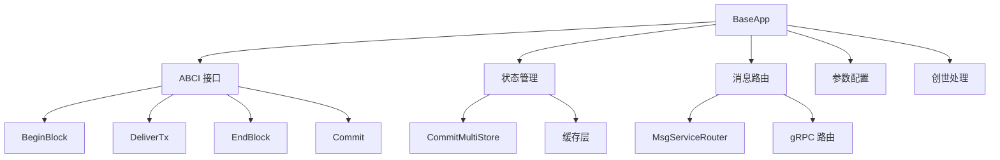
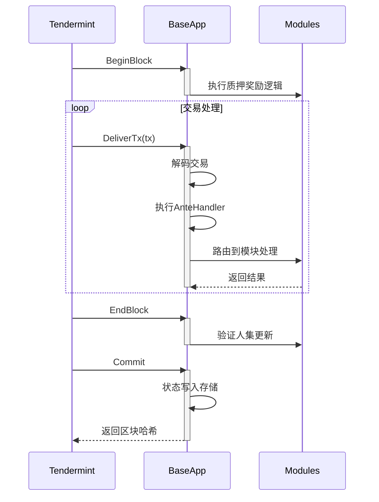
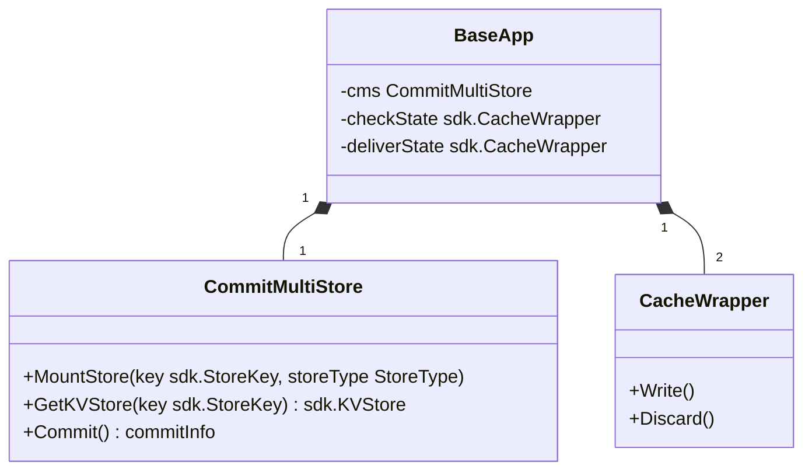
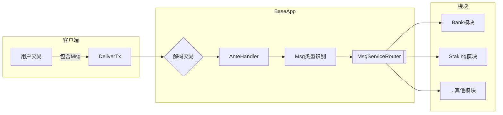
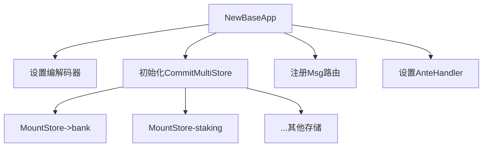
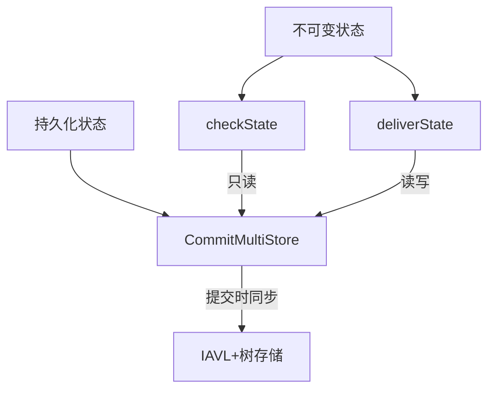

# BaseApp 架构总览

```mermaid
graph TD
  A[BaseApp] --> B[ABCI 接口]
  A --> C[状态管理]
  A --> D[消息路由]
  A --> E[参数配置]
  A --> F[创世处理]
  B --> B1[BeginBlock]
  B --> B2[DeliverTx]
  B --> B3[EndBlock]
  B --> B4[Commit]
  C --> C1[CommitMultiStore]
  C --> C2[缓存层]
  D --> D1[MsgServiceRouter]
  D --> D2[gRPC 路由]
```
# ABCI 实现详解
生命周期流程图

```mermaid
sequenceDiagram
  participant T as Tendermint
  participant B as BaseApp
  participant M as Modules

  T->>B: BeginBlock
  activate B
  B->>M: 执行质押奖励逻辑
  deactivate B

  loop 交易处理
    T->>B: DeliverTx(tx)
    activate B
    B->>B: 解码交易
    B->>B: 执行AnteHandler
    B->>M: 路由到模块处理
    M-->>B: 返回结果
    deactivate B
  end

  T->>B: EndBlock
  activate B
  B->>M: 验证人集更新
  deactivate B

  T->>B: Commit
  activate B
  B->>B: 状态写入存储
  B-->>T: 返回区块哈希
  deactivate B
```

# 状态管理机制
存储结构图

```mermaid
classDiagram
  class CommitMultiStore{
    +MountStore(key sdk.StoreKey, storeType StoreType)
    +GetKVStore(key sdk.StoreKey) sdk.KVStore
    +Commit() commitInfo
  }

  class BaseApp{
    -cms CommitMultiStore
    -checkState sdk.CacheWrapper
    -deliverState sdk.CacheWrapper
  }

  class CacheWrapper{
    +Write()
    +Discard()
  }

  BaseApp "1" *-- "1" CommitMultiStore
  BaseApp "1" *-- "2" CacheWrapper
```

# 消息路由系统
路由流程图

```mermaid
flowchart LR
  subgraph 客户端
    A[用户交易] -->|包含Msg| B
  end

  subgraph BaseApp
    B[DeliverTx] --> C{解码交易}
    C --> D[AnteHandler]
    D --> E[Msg类型识别]
    E --> F[[MsgServiceRouter]]
  end

  subgraph 模块
    F --> G[Bank模块]
    F --> H[Staking模块]
    F --> I[...其他模块]
  end
```

# 初始化配置流程

```mermaid
flowchart TB
  A[NewBaseApp] --> B[设置编解码器]
  A --> C[初始化CommitMultiStore]
  A --> D[注册Msg路由]
  A --> E[设置AnteHandler]
  C --> C1[MountStore->bank]
  C --> C2[MountStore-staking]
  C --> C3[...其他存储]
```

# 关键设计模式图解

```mermaid
graph TD
  A[不可变状态] --> B[checkState]
  A --> C[deliverState]
  D[持久化状态] --> E[CommitMultiStore]
  
  B -->|只读| E
  C -->|读写| E
  E -->|提交时同步| F[IAVL+树存储]
```

