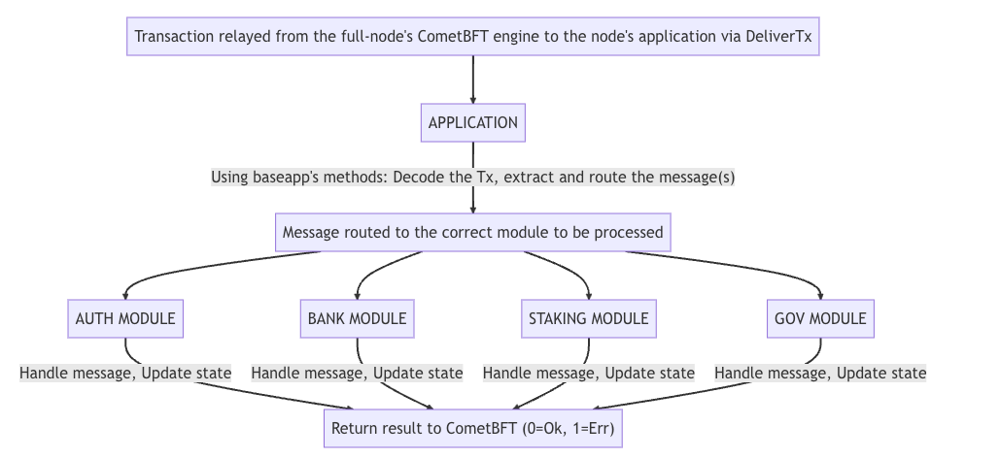

## 一、核心架构设计
1. 模块化框架
Cosmos SDK采用模块化设计，开发者可复用预置模块（如质押、治理、跨链通信）或自定义模块。
模块间通过Keeper对象实现安全交互，每个模块仅暴露授权接口。

2. 状态机与存储
- 区块链本质是确定性状态机，通过交易触发状态转换
- 使用multistore实现多层级KV存储，支持模块独立管理数据空间
- 数据序列化采用确定性编解码器（默认Amino）

3. ABCI接口集成
Tendermint通过ABCI协议与应用层交互，关键消息包括：
- CheckTx：交易预验证（防垃圾交易,保护Mempool免受垃圾邮件交易,AnteHandler处理程序用于执行一系列验证步骤
- DeliverTx：交易正式执行(当CometBft收到有效的块时，该块中的每个事务都通过Delivertx传递给应用程序以处理，AnteHandler再次执行，并为交易中的每个消息执行实际的MSG服务RPC。)
- BeginBlock/EndBlock：区块前后触发逻辑,开头和末尾都执行，无论该块是否包含交易。触发自动执行逻辑很有用。请谨慎行事，因为计算昂贵的环路可能会减慢区块链的速度，甚至在循环是无限的情况下将其冻结。

## 二、关键组件
1. BaseApp
SDK提供的ABCI实现基类，处理消息路由、交易解码、gas计量等基础逻辑，开发者通过继承实现定制应用。

2. 交易处理流程


3. 跨链通信（IBC）
通过轻客户端验证和中继器实现链间资产/数据转移，支持构建多链生态

4. 数据可用性层


流程解析：
1. 交易传播阶段
    - 用户交易首先通过轻节点广播到Rollup网络
    - 全节点执行第一层验证（签名有效性、格式合规性等）
  
2. 区块生产阶段
    - 排序器对有效交易进行排序打包，利用DA层（如Celestia）实现：
    - 数据持久化存储
    - 全局排序共识
    - 抗审查保障

3. 数据验证阶段
    - 轻节点通过采样验证确保：
        - 区块数据完整可获取（Data Availability）
        - 交易顺序与DA层记录一致（Correct Ordering）

4. 证明生成阶段
    - 乐观Rollup：全节点生成欺诈证明，需配合挑战期机制
    - ZK-Rollup：生成零知识证明（zk-SNARKs/STARKs），实现即时最终性

1. 状态确认阶段
    - 网络节点对证明进行双重验证：
        - 验证DA层数据与本地执行结果的一致性
        - 检查证明的数学有效性（针对ZK-Rollup）
    - 失败时触发回滚机制（乐观方案）或证明重构（ZK方案）

核心设计特点：
1. 分层验证机制：轻节点负责数据可用性验证，全节点承担计算完整性验证
2. 模块化架构：DA层与执行层解耦，支持灵活更换底层组件
3. 终局性差异：乐观方案依赖挑战期（通常7天），ZK方案通过数学证明实现即时终局
4. 抗审查保障：通过DA层确保区块数据不可篡改且永久可查


# 三、交易流程分析

### 架构概览
Cosmos SDK采用模块化状态机设计，通过ABCI接口与Tendermint共识引擎协同工作。核心组件包括：

BaseApp：处理ABCI消息路由、交易解码、Gas计量
Multistore：分片化KV存储系统，支持模块独立数据空间
Modules：功能单元（如Bank, Staking, Governance），通过Keeper控制状态访问
IBC：跨链通信协议

### 交易处理流程


1. 交易验证阶段（CheckTx）
- 验证数字签名有效性
- 检查账户余额是否足够支付Gas费
- 执行AnteHandler链（可自定义预处理逻辑）

2. 交易执行阶段（DeliverTx）
- 解码交易获取Msg对象
- 通过Router将Msg路由到注册模块
- 模块的Handler调用Keeper方法修改状态
- 状态变更暂存于缓存，直到区块提交

3. 区块生命周期
- BeginBlock：触发质押奖励发放等周期性逻辑
- EndBlock：执行治理提案生效、验证人集更新
- Commit：将缓存状态写入持久化存储，生成Merkle根

4. 每个模块都定义了状态的子集并包含其自己的消息/事务处理器，而Cosmos SDK负责将每个消息路由到其各自的模块。


### 状态管理机制

1. 存储结构
   ```rust
   Multistore
    ├── root (IAVL树)
    │   ├── acc (账户模块数据)
    │   ├── staking (质押模块数据)
    │   └── ...
    ├── transient (临时存储)
    └── flat (平面文件存储)
    ```
2. 读写操作
   - Keeper通过StoreKey访问特定子存储
   - 写操作使用CacheWrapper实现原子性
   - 支持历史版本查询（通过高度参数）


