## IBC协议核心解析

### 一、协议架构分层
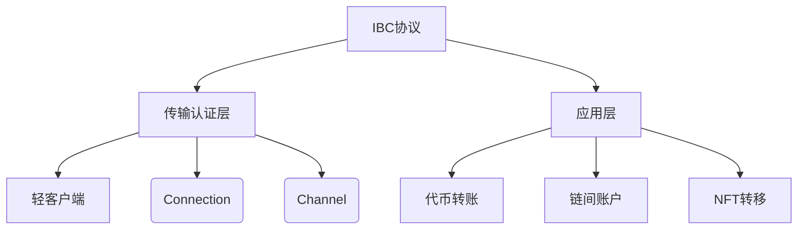

### 二、核心工作机制

1. 连接建立流程（四次握手）
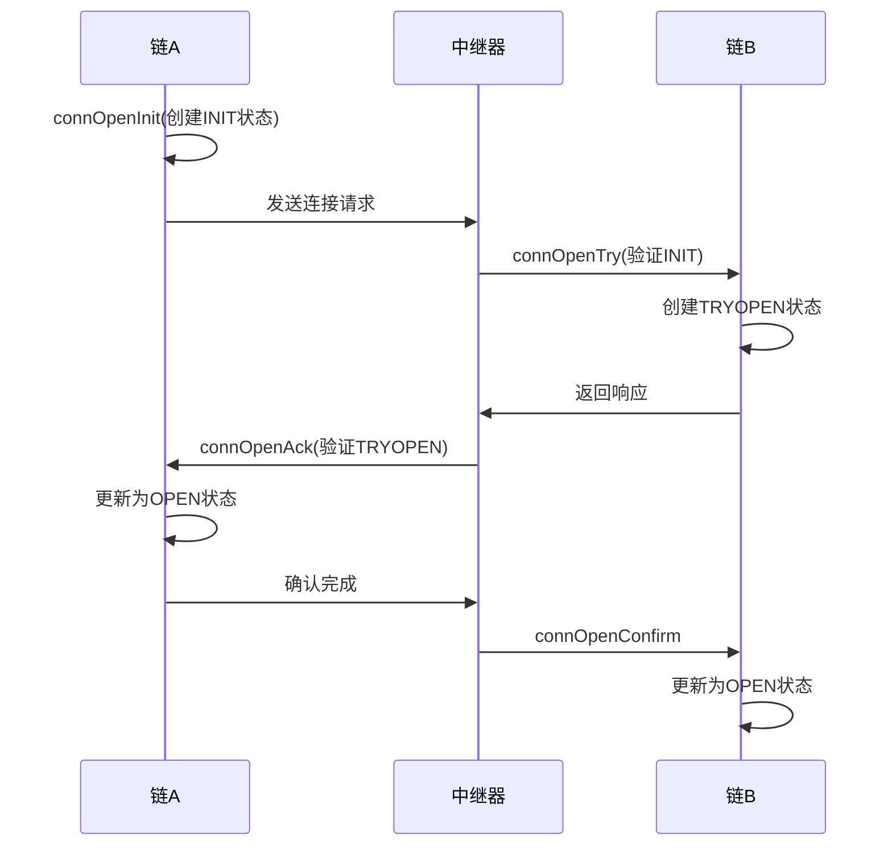

2. 代币跨链转移流程
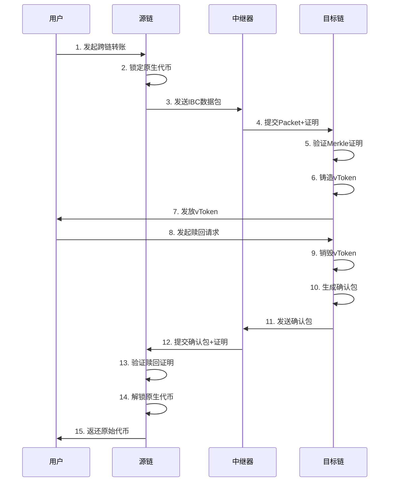

### 三、关键特性对比
| 特性     | IBC协议      | 传统跨链桥     |
| -------- | ------------ | -------------- |
| 信任模型 | 轻客户端验证 | 第三方托管     |
| 通信方式 | 双向有序通道 | 单向桥接       |
| 升级机制 | 通道可升级   | 硬分叉升级     |
| 安全边界 | 链间独立验证 | 中心化验证节点 |

## IBC通道机制深度解析

### 一、核心概念图解
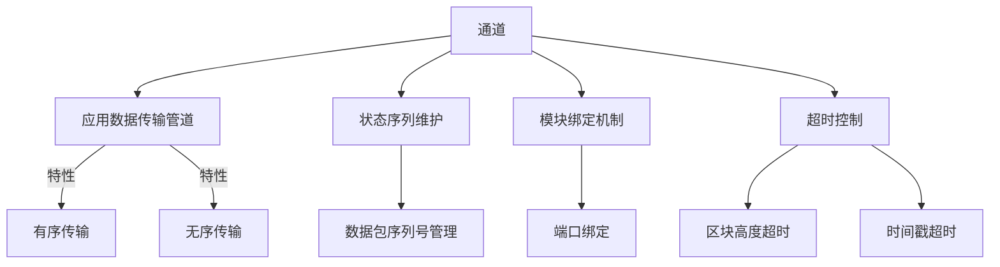

### 二、通道生命周期

1. 通道握手流程
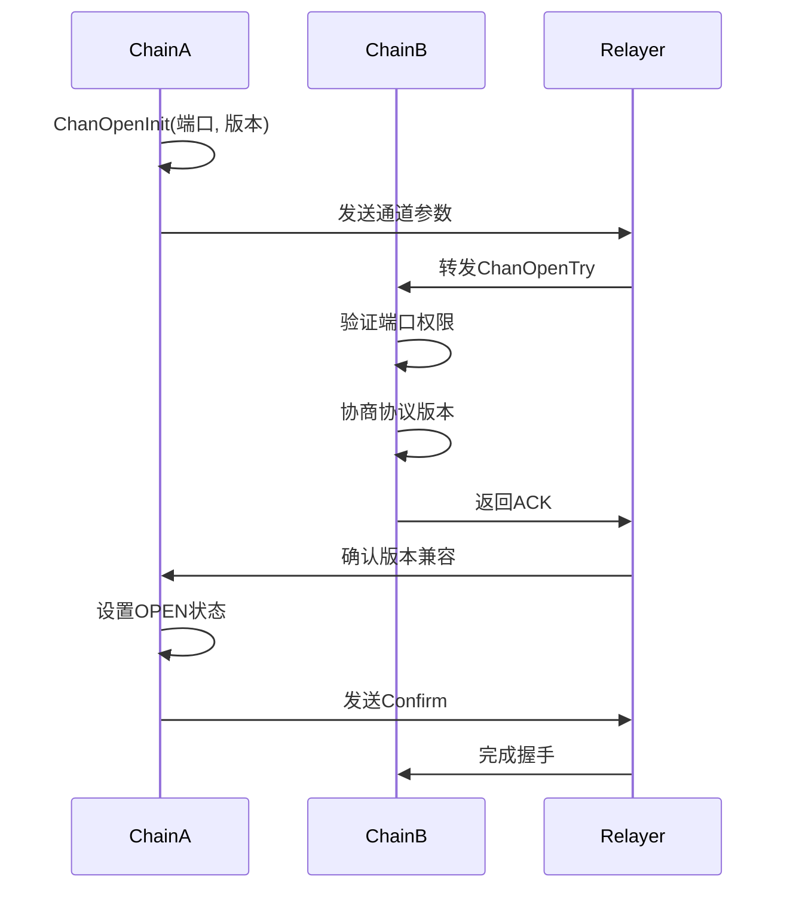
2. 状态转换机制
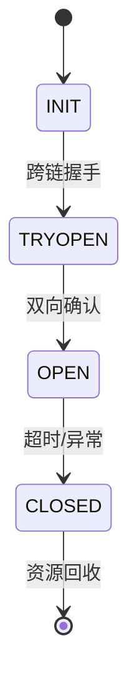

### 三、核心功能模块
数据包结构
| 字段                | 类型   | 作用描述         |
| ------------------- | ------ | ---------------- |
| sequence            | uint64 | 严格递增的序列号 |
| source_port         | string | 源链端口标识     |
| source_channel      | string | 源链通道标识     |
| destination_port    | string | 目标链端口       |
| destination_channel | string | 目标链通道       |
| data                | bytes  | 应用层原始数据   |
| timeout_height      | Height | 区块高度超时阈值 |
| timeout_timestamp   | uint64 | 时间戳超时阈值   |

通道关键参数
| 参数           | 示例值      | 约束条件             |
| -------------- | ----------- | -------------------- |
| ordering       | ORDERED     | 必须与连接参数一致   |
| version        | ics20-1     | 双方协商确定         |
| timeout_period | 3600 blocks | 需大于链的最终性时间 |
| max_retries    | 5           | 防止无限重试         |
### 四、安全机制设计
四重验证体系
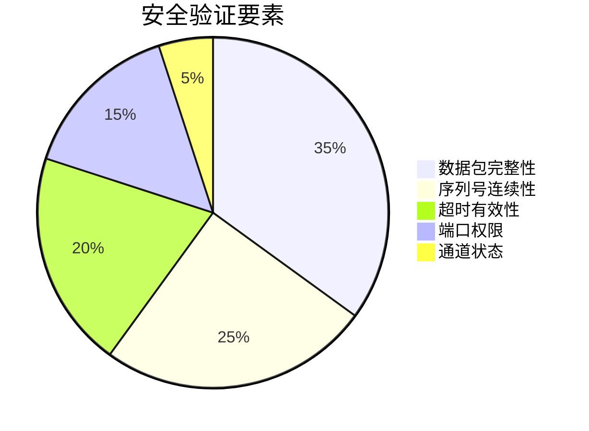
异常处理场景
| 异常类型     | 处理方式     | 恢复方案          |
| ------------ | ------------ | ----------------- |
| 数据包丢失   | 触发超时机制 | 自动重试(最多5次) |
| 序列号错乱   | 冻结通道     | 需新建通道        |
| 版本不兼容   | 拒绝握手     | 升级模块后重试    |
| 签名验证失败 | 丢弃数据包   | 记录日志人工干预  |
### 五、与连接的差异对比
| 对比维度 | 连接(Connection)    | 通道(Channel)          |
| -------- | ------------------- | ---------------------- |
| 功能定位 | 链间身份验证管道    | 应用数据传输管道       |
| 数量关系 | 1个连接对应多个通道 | 1个通道绑定1个应用模块 |
| 生命周期 | 长期保持            | 按需创建/关闭          |
| 安全验证 | 客户端状态验证      | 数据包完整性验证       |
| 协议层级 | TAO传输层           | APP应用层              |
### 六、开发注意事项
1. 🔄 序列号管理：
   - 发送/接收序列号独立维护
   - 必须严格单调递增

2. 🔐 权限控制：
   - 通道必须绑定指定端口
   - 模块需拥有端口控制权(Capability)

3. ⏱️ 超时设置：
   - 建议超时高度 > 当前高度+100
   - 时间戳超时建议 > 当前时间+15分钟

4. 🛠️ 版本协商：
   - 支持多版本协商机制
   - 必须包含双方都支持的版本

### 七、应用场景示例
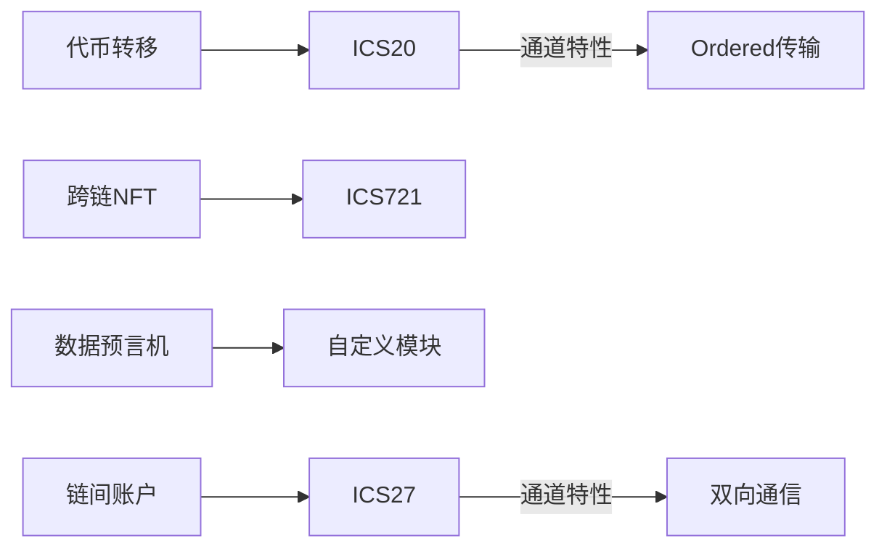

# IBC客户端机制深度解析

## 一、客户端核心架构
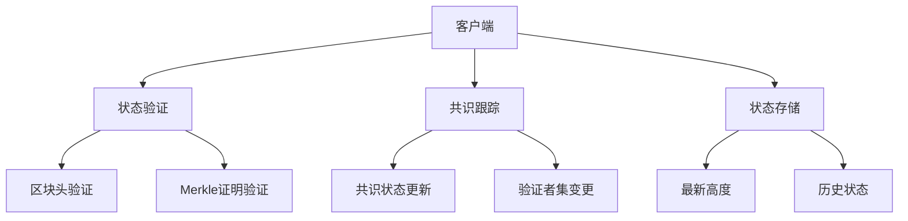

## 二、客户端生命周期  
### 状态转换流程
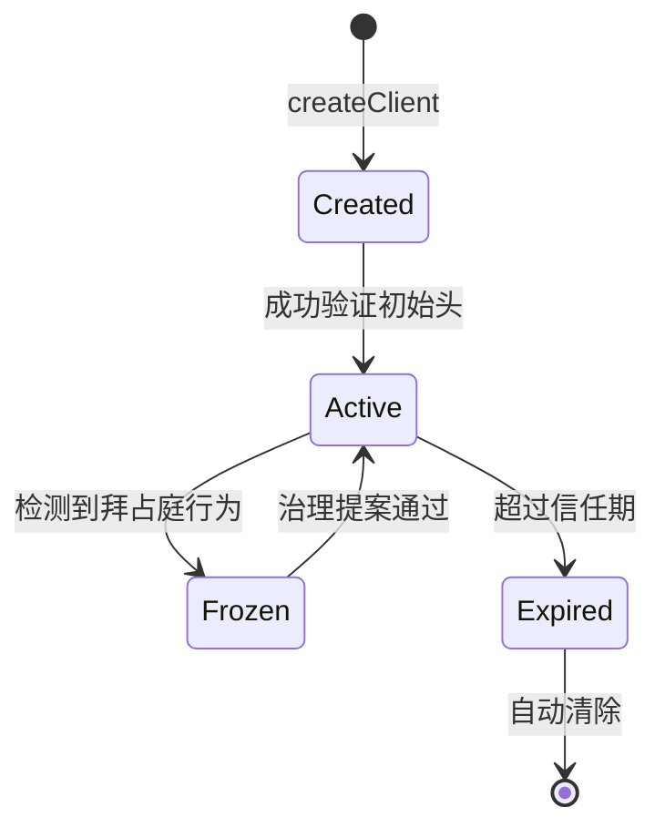

### 关键操作序列
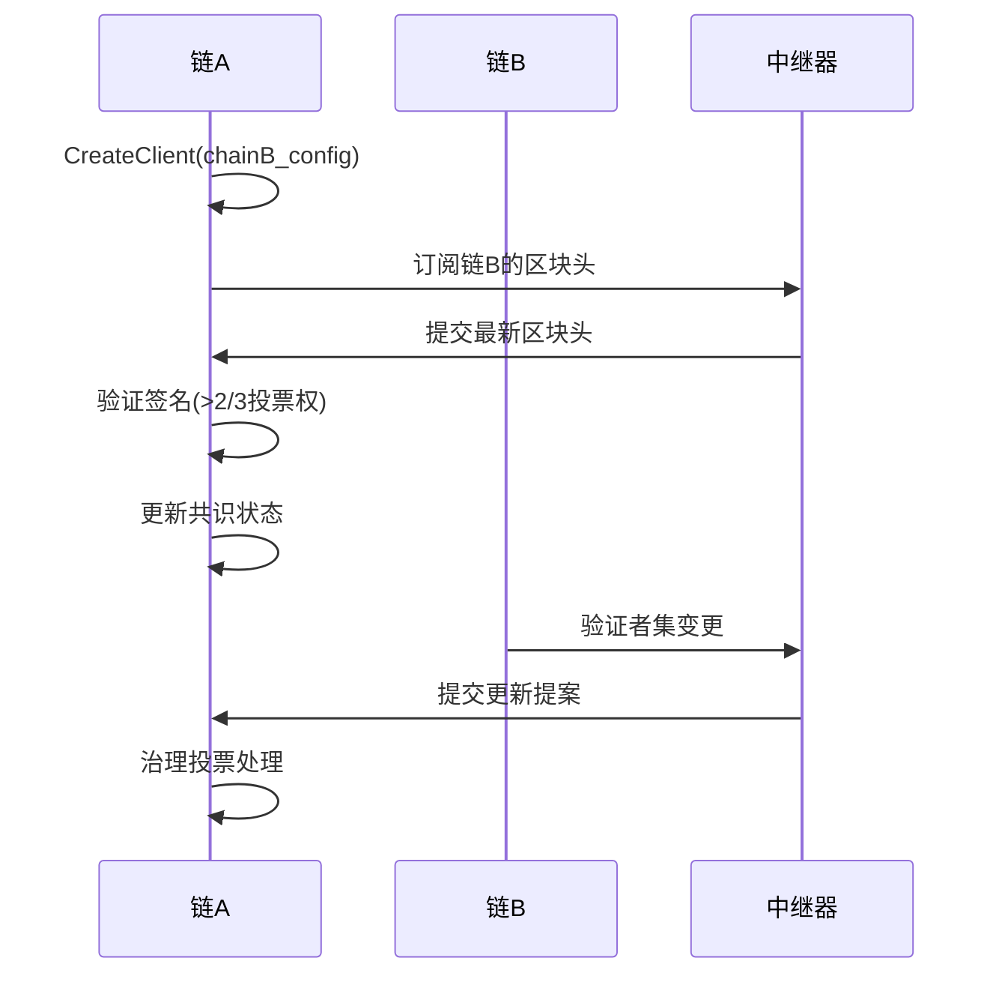

### 客户端类型对比
| 特性         | Tendermint Client | Solo Machine Client |
| ------------ | ----------------- | ------------------- |
| 共识类型     | BFT               | 单签名机制          |
| 验证者集更新 | 自动跟踪          | 手动更新            |
| 信任阈值     | 1/3+              | 100%                |
| 适用场景     | 链间通信          | 移动设备/IoT        |
| 存储开销     | 高(存储历史状态)  | 低                  |
| 安全模型     | 经济安全          | 私钥安全            |

### 安全机制详解
信任模型三要素
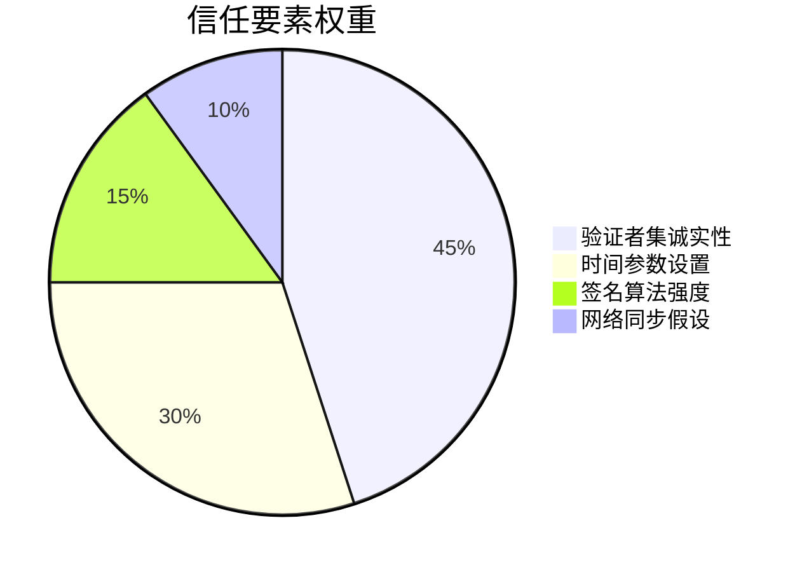
双重超时保护
| 超时类型   | 触发条件                               | 处理措施     |
| ---------- | -------------------------------------- | ------------ |
| 信任期超时 | now > consensus_time + trusting_period | 客户端过期   |
| 解绑期超时 | now > unbonding_time                   | 允许资产解绑 |

### 客户端治理流程

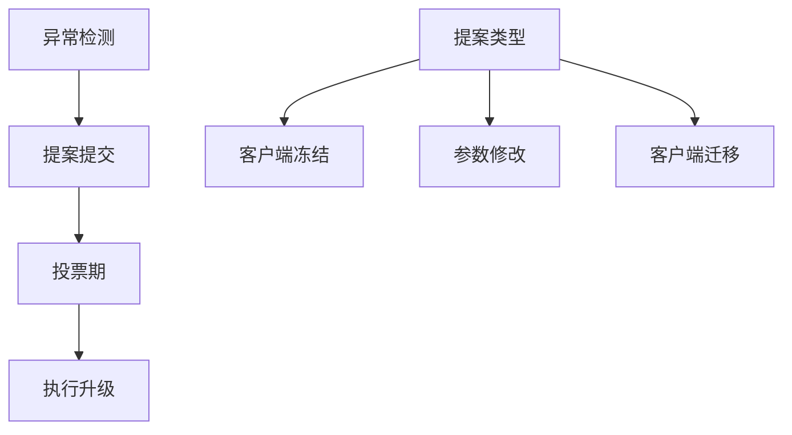

参数配置建议
| 参数               | 推荐值             | 计算公式                 |
| ------------------ | ------------------ | ------------------------ |
| trusting_period    | 2/3 unbonding_time | T_trust = (2/3)*T_unbond |
| max_clock_drift    | 30秒               | 2*avg_block_time         |
| allow_update_after | 100个区块          | 最终确定性确认所需       |

监控指标清单
- 客户端最新高度滞后值
- 验证者集变更频率
- 信任期剩余时间百分比
- 异常冻结事件计数

攻击防御矩阵 
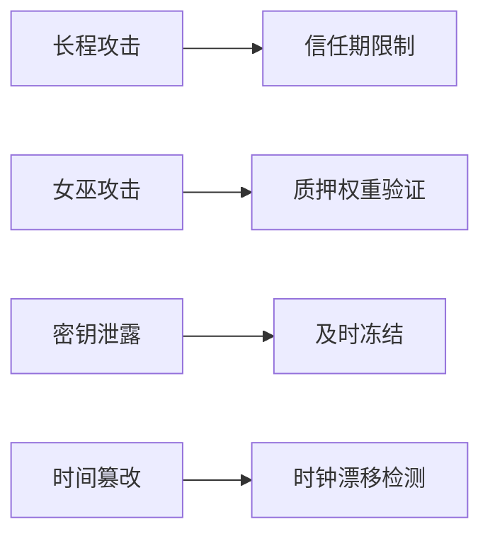

# IBC代币转移机制深度解析

## 一、核心协议架构
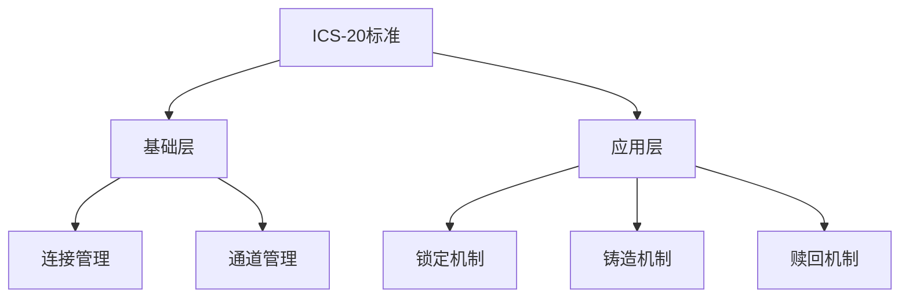

1. 代币追踪机制
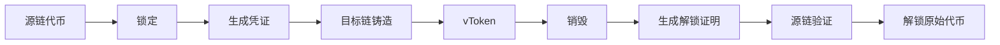

2. 跨链代币标识规则

| 代币类型 | 格式示例                | 生成规则                        |
| -------- | ----------------------- | ------------------------------- |
| 原生代币 | uatom                   | 链原生定义                      |
| vToken   | ibc/27394FB092D2ECCD... | SHA256(源链ID+通道ID+原始denom) |

## 安全机制设计
1. 双重验证体系
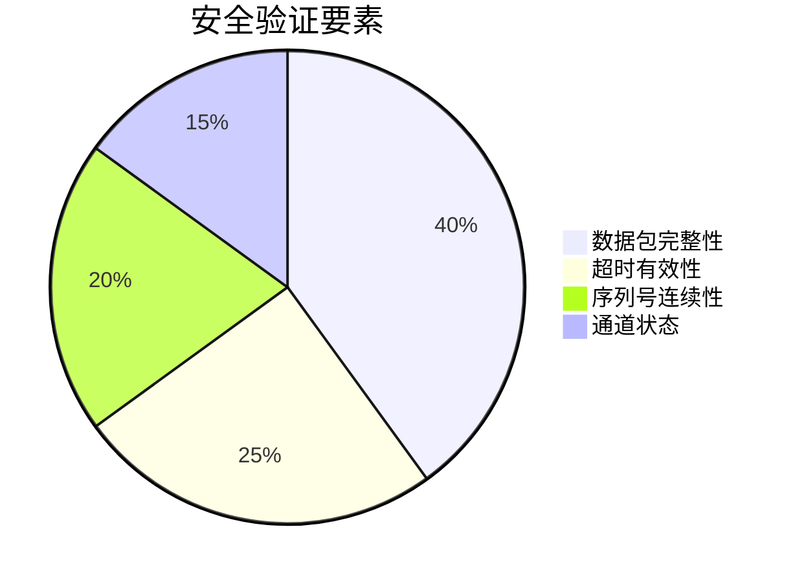
2. 异常处理场景

| 异常类型   | 处理方式       | 恢复方案          |
| ---------- | -------------- | ----------------- |
| 数据包丢失 | 触发高度超时   | 自动重试(最多5次) |
| 验证失败   | 丢弃数据包     | 需人工干预        |
| 通道异常   | 冻结关联代币   | 新建通道迁移      |
| 双花攻击   | 序列号校验拦截 | 永久冻结恶意账户  |

3. 监控指标清单

- 通道待处理数据包数量
- vToken供应量与锁定量的比率
- 跨链转账平均延迟
- 超时事件发生频率
- 通道健康状态(OPEN/CLOSED)

1. 🔄 代币面额处理：
   - 必须保持denom全局唯一性
   - 转换精度时使用最小单位

2. 🔐 安全边界：
   - 设置单通道最大转账限额
   - 实现防重放攻击机制

3. ⚠️ 特殊场景：
   - 处理链升级时的代币迁移
   - 应对验证者集变更影响

4. 📊 监控建议：
   - 实时报警通道异常状态
   - 定期审计跨链代币余额

## 常见问题解答
Q: 为什么需要锁定/铸造机制？
A: 确保跨链代币总量守恒，防止双花

Q: vToken能否跨链转回？
A: 必须通过赎回流程销毁vToken后解锁原链资产

Q: 如何处理不同链的精度差异？
A: 转换到最小单位进行计算，显示层做格式化

Q: 转账卡住怎么办？
A: 检查步骤：
   1. 确认通道状态
   2. 查看中继器日志
   3. 验证超时参数
   4. 检查余额是否充足

